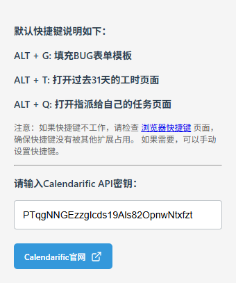

## 功能说明：
- **填充模板 - `Alt + G`**：在编辑 Bug 表单时，填充BUG表单模板
- **查看工时 - `Alt + T`**：打开过去31天的工时页面
- **我的任务 - `Alt + Q`**：查看指派给自己的任务
- **显示优化**：在“我的工作台”页面，加深“当日耗时”背景色；优化提单列表的排版；高亮下拉选择框的鼠标悬停背景色
- **自动更新完成度**：编辑表单时，将状态设置为“已解决”，自动将“完成百分比”同步更新为 100%

## 插件安装步骤（以Chrome为例）：
1. 从SVN上拉取“Redmine插件”文件夹（URL：https://192.168.30.200/svn/研发中心/技术积累/软件开发部/工具软件/Redmine插件）
2. 打开浏览器设置，找到拓展程序
3. 打开右上角“开发者模式”
4. 按F5刷新页面
5. 将“Redmine Plugin”文件夹拖入页面安装

   
## 插件更新步骤：
1. 从SVN上拉取最新的插件
2. 打开浏览器拓展程序页面
3. 点击此拓展程序右下角的“更新”按钮（多点几下）

## 插件使用注意事项：
1. 填充BUG表单模板需要先在BUG表单页面点击编辑，进入编辑状态后再 ALT + G 进行填充
2. ALT + T 打开的工时页面没有颜色显示，大多是因为网络原因，Get数据比较慢，等待一会
3. 点击插件图标可以看到快捷键说明
   

   
## Calendarific API申请指南：
1. 大家添加完插件之后，按步骤将拓展挂在浏览器上

2. 点开拓展，点击进入官网

3. 注册完账号之后可以在后台看到API秘钥

4. 把秘钥复制到拓展窗口页面的输入框中，然后刷新页面即可